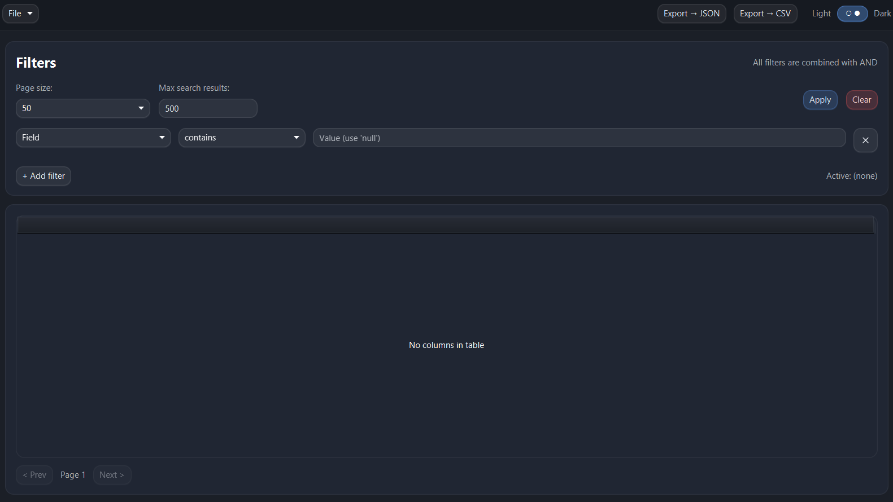
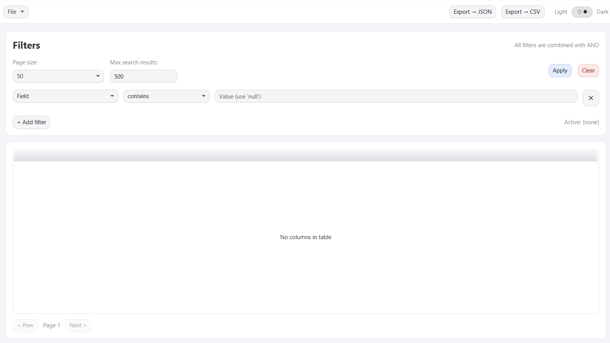

# Avro Viewer (JavaFX)

A lightweight desktop tool for viewing, filtering, and exporting Avro files.

Avro Viewer is a **modular JavaFX application** designed for fast inspection of large Avro datasets.
It provides a clean UI, flexible filtering, and a portable “click-and-run” distribution
with a bundled Java Runtime — no separate Java or JavaFX installation required.

---

## ✨ Features

- Open and inspect `.avro` files
- JSON tree view for complex records
- Dynamic filter builder (AND-combined filters)
- Pagination and result limiting
- Export filtered data to:
  - JSON
  - CSV
- Light / Dark theme
- **Cross-platform:** Native builds for Windows, macOS, and Linux

---

## 📥 Downloads & Installation

Go to the **Releases** page to download the latest version for your operating system:

- **Windows:** Download `.zip`, extract, and run `AvroViewer.exe`.
- **Linux:** Download `.zip`, extract, and run the launcher in `bin/`.
- **macOS:** Download `.zip`, extract `AvroViewer.app`.

### 🍎 macOS Users (Important!)

Since this application is not signed with a paid Apple Developer ID, macOS Gatekeeper may block it with a message:
> *"AvroViewer is damaged and can't be opened"* or *"Permission denied"*.

To fix this, open your **Terminal** and run the following command to remove the quarantine attribute:

```bash
sudo xattr -cr /path/to/AvroViewer.app
```
(Tip: Type sudo xattr -cr , add a space, then drag and drop the app icon into the terminal window).

---

## 🧱 Architecture Overview
* Java 25
* JavaFX (modular)
* Apache Avro
* Jackson (JSON / CSV export)
* Custom Java runtime built via jpackage

---

## 🔧 Development
Prerequisites

* JDK 25 (java -version)
* Maven 3.9+

#### Run Locally

##### Build the project:
```bash
mvn clean install
```

##### Run the JavaFX application:

```bash
mvn -pl impl javafx:run
```

## 🚀 Release Process (CI/CD)
This project uses GitHub Actions to automatically build and release portable applications for Windows, macOS, and Linux.

```
git tag v1.0.0
git push origin v1.0.0
```

GitHub Actions will automatically:

* Build the JARs.
* Run jpackage for all 3 OSs.
* Create a draft release with attached .zip artifacts.

---

## 📦 Distribution Structure
The generated portable archive contains:

* AvroViewer (or .exe / .app) # Main application launcher
* app/ # Application JARs and dependencies
* runtime/ # Custom bundled Java runtime

Users can extract the archive and run the application immediately.

---

## 📜 License

This project is licensed under the MIT License. See the [LICENSE](LICENSE) file for details.

---

## 🛠️ Status

Avro Viewer is actively developed and intended for internal tooling, data inspection, and developer workflows.
Contributions, issues, and suggestions are welcome.

---

## 📸 Screenshots

Dark main view:


Light main view:

*Filtering and inspecting Avro records*

## Credits

- Application icon generated using Google Gemini (AI)
