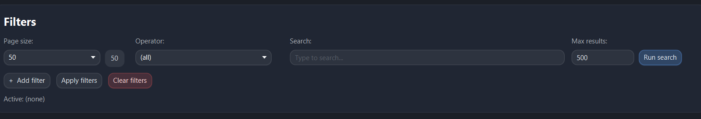

1. Add Spring Boot for DI etc
2. Maybe add small caffeine cache in AvroFileServiceImpl? (maxSize=3-5; expirationTime=???). With complex cache key like: pageSize_pageIndex... something else
3.  Remove label for the pageSize. Redo pagination to have less pageSize selector.
4. For filters, we need potentially several selectors: 1) field 2) type (equals/contains) 3) value
5. For future, for filters, will be good to have type "between", and have instead of 1 condition for value - two. But to be analyzed how better to do.